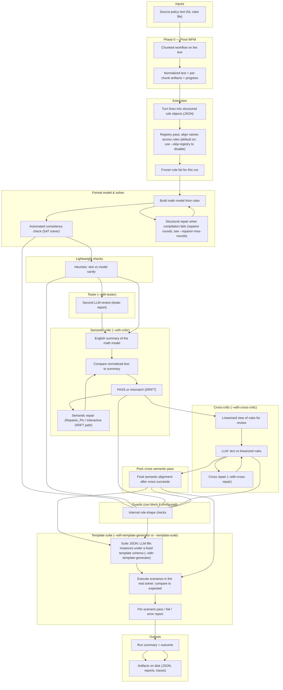

# Pivot pipeline architecture

Overview of the full pivot pipeline (including Pivot WFM), with a diagram and a plain-language workflow for readers who are not familiar with project-specific vocabulary.

## Viewing the diagram

The diagram below is written in [Mermaid](https://mermaid.js.org/). A plain text editor shows the source only; you need a **Markdown preview that supports Mermaid**, or view this file on **GitHub** (which renders Mermaid in `.md` files). You can also paste the fenced `mermaid` block into [mermaid.live](https://mermaid.live) to view or export PNG/SVG.

---

## Architecture diagram

### How to read the diagram

- **Top to bottom** is the usual order of stages for a given run.
- **Default CLI** runs WFM → extract (with registry, unless `--skip-registry`) → compile → Z3 → precheck → outcome. Stages in boxes labeled with **`--with-...`** run only when that flag is set (or when a failure triggers repair loops).
- **Structural repair** runs when compilation fails and LLM repair is allowed (not when `--no-llm` or repair rounds are zero).
- **Guards** (internal rule-shape checks) can run at several points and may **stop the run** if you pass strict failure flags.
- **Template suite** runs **late** (after critic / cross / post–cross paths when those run), so it exercises the model produced by that run. **Template kinds and JSON shape are fixed by schema**; with `--with-template-generator`, an LLM **instantiates** concrete tests (worlds, queries, golden expectations) from policy context—not inventing the template format.

---

## Workflow (plain language)

**What you start with**  
Someone writes a policy as a list of plain-English rules in a file. The pipeline’s job is to make that policy **precise enough for a computer to reason about** and to give you **evidence** that the computer’s version matches what the English says.

**Step 1 — Clean and stabilize the English (Pivot WFM)**  
The system processes the file **in chunks** through a fixed writing workflow. It may rewrite unclear phrasing, split or merge chunks, and records what it did per chunk so you can **resume** if something fails mid-run. The main output is **normalized English**: the version of the policy the rest of the steps will treat as authoritative, plus supporting logs and handoff records.

**Step 2 — Extract structured rules**  
A step (often LLM-assisted) turns the normalized English into a **structured list of rules**—conditions, thresholds, allowed values, exceptions—in a machine-readable format. **By default**, an **identifier registry** pass **standardizes names** (variables, enums) so everything lines up; you can skip it with `--skip-registry` when you need to. If extraction hits a bad line, interactive mode can ask how to fix or skip.

**Step 3 — Build a formal model and ask the solver**  
Those structured rules are **compiled** into a mathematical model. A **solver** checks whether the policy-as-modeled can “make sense” together (for example, is not trivially impossible in the way the encoding expects). If compilation fails, the pipeline can run **structural repair** for a configured number of rounds (see `--repairer-max-rounds`) to fix the rule shape and retry before surfacing a hard failure.

**Step 4 — Quick sanity pass**  
A lightweight check compares the English and the model for obvious mismatches (for example numbers that appear in the model but not in the source text). This is **heuristic**: it can warn without meaning the model is wrong.

**Step 5 — Tester (`--with-tester`)**  
When enabled, a **second LLM review** produces a **tester report**—another semantic pass before or alongside deeper alignment stages, depending on how you invoke the CLI.

**Step 6 — Semantic critic (`--with-critic`)**  
When enabled, the system generates a **plain-English description of what the math model actually enforces** and compares it to the normalized policy text. If they disagree in a material way, you get a **mismatch (DRIFT)** verdict; you can run **semantic repair**, type through interactive prompts, or explicitly agree to continue with known gaps (`PROCEED_INCOMPLETE`-style handoff).

**Step 7 — Cross-critic (`--with-cross-critic`)**  
When enabled, another step compares the policy text to a **flattened, line-by-line rendering** of the formal rules—useful for catching drift in how conditions were encoded. **`--with-cross-repair`** allows an automated repair loop when the cross review reports issues (subject to interactive gates if you enable them).

**Step 8 — Post–cross semantic pass**  
If cross-critic ran and succeeded on your chosen path, the pipeline runs a **final semantic alignment** check so text and model still agree after any cross-stage edits.

**Throughout — internal shape checks**  
The pipeline runs **internal consistency checks** on how certain rule patterns are encoded (for example special “product” patterns). Depending on flags, failures here **block** the run.

**Step 9 — Template suite (`--with-template-generator` / `--template-suite`)**  
Near the end of a successful run, you can **ask the LLM to populate** a JSON suite—**using predefined template kinds** (scenario types, fields, and schema are fixed; the model only fills in allowed instances from your policy context)—or **supply** a suite file you wrote or checked in yourself. Each scenario is executed with the **real solver** and compared to expectations in the file; a **report** records pass, fail, and error counts. Template failures are typically **non-fatal** for the pipeline exit code (they inform you without always blocking the run).

**What you end up with**  
On disk you get **normalized text**, **structured rules**, **compiled model**, **solver output**, **reports from whichever alignment stages you enabled**, and a **single run summary** that says whether the run completed, was blocked, or finished with warnings. Together that package is what you would share or archive to show **what was formalized and how strongly it was validated**.
