# Pipeline: Natural language → WFM → ClinCon policy

This document is the canonical story of the **ASP/ClinCon pipeline**: how unstructured (or lightly structured) policy rules become **reviewed logical lines** under Word-for-Machine (WFM), then become **incremental ClinCon** policy commits under the `asp_pipeline`. It states **scope**, **step-level input/output contracts**, **prompt specifications**, **repair logic**, and how this design **extends** to larger policies built from many bundles over time.

**Engineering roadmap:** [`dev_plans/dev_plan_implementation_clincon_asp_v1.md`](../dev_plans/dev_plan_implementation_clincon_asp_v1.md) maps this spec onto the existing repo (new `asp_pipeline`, WFM Agent 3 updates, batch runners, tests).

**Commit/failure contract, partial commit logic, bundle record schema, and idempotency** are carried over unchanged from the SMT pipeline. Where those topics are not re-specified here, the SMT pipeline spec is authoritative.

**WFM behavior** is unchanged. Where WFM details are not re-specified here, the existing WFM spec is authoritative.

---

## 1. Why this pipeline exists

Organizations need to move from **English policy text** to **machine-checkable, executable** artifacts without losing auditability. The pipeline splits that problem into two separable concerns:

1. **WFM** turns a single rule narrative into a **structured handoff**: discrete lines, each with an explicit Agent 3 verdict (pass, rewrite, reject scope, etc.), suitable for registry and downstream tooling.
2. **ASP pipeline** takes each accepted handoff and turns **in-scope** lines into **ClinCon** fragments, validates them with a **critic loop**, and **commits** them into a growing `policy_model`-style file.

Beyond what the SMT pipeline offered, this pipeline targets capabilities ClinCon provides that FOL/SMT does not: **non-monotonic reasoning** (defaults, exceptions, overrides), **constraint solving over mixed domains** (linear arithmetic + logic), **optimization** (minimize/maximize over policy-satisfying answer sets), and **simulation** (multi-step state transitions, game rules, agentic guardrails).

---

## 2. Scope: the ClinCon-safe fragment

The ASP pipeline enforces that committed rules stay within the **ClinCon-safe fragment**. This is the necessary and sufficient condition for deterministic parse and grounding. The formalizer prompt must communicate these boundaries; Agent 3 must flag violations as OUT_OF_SCOPE before formalization is attempted.

### 2.1 In scope — with examples

**Relations (predicates returning Bool), any arity**
- ✅ `is_man(michael).`
- ✅ `taller_than(peter, michael).`
- ❌ `f(X) = Y` where f produces a non-Bool term (term-level function)

**Named constant domains (finite, explicitly declared)**
- ✅ `person(michael). person(peter). person(windy).`
- ✅ `season(spring). season(summer). season(autumn). season(winter).`
- ❌ `person(X) :- X > 0.` (infinite, computed domain)

**Universal rules (Horn clauses)**
- ✅ `can_block(X, Y) :- is_man(X), is_man(Y), taller_than(X, Y).`
- ❌ Rules with function symbols in head term positions

**Negation as failure (NAF) — stratified only**
- ✅ `jumps_when_shooting(windy) :- not cannot_jump(windy).`
- ❌ Cyclic negation: `a :- not b. b :- not a.` where both are in the same stratum with mutual dependency through negation (unstratified)

**Default rules with exceptions (non-monotonic)**
- ✅ `permitted(X, Action) :- agent(X), not prohibited(X, Action).`
- ✅ `prohibited(X, access) :- restricted(X).` (overrides the default above for restricted agents)

**Choice rules (existential conclusions, player choices)**
- ✅ `1 { promoted_to(P, queen); promoted_to(P, rook); promoted_to(P, bishop); promoted_to(P, knight) } 1 :- pawn_reaches_end(P).`
- ❌ Unbounded choice over an open domain

**Aggregates over finite domains**
- ✅ `#count { X : piece(X), color(X, white) } = N, N < 2` (insufficient material check)
- ❌ Aggregate over an ungrounded or infinite set

**Optimization directives**
- ✅ `#minimize { 1,X : violation(X) }.`
- ✅ `#maximize { V,X : score(X,V) }.`

**Bounded integer arithmetic via ClinCon constraint variables**
- ✅ `:- &sum{ Rate } > 100.` (rate limit)
- ✅ `:- &sum{ Income; -Threshold } > 0.` (linear arithmetic only)
- ❌ `:- &sum{ X*X } > 100.` (nonlinear — X squared)

**Time-indexed state / fluent predicates**
- ✅ `holds(taller(peter, michael), 0).`
- ✅ `holds(F, T+1) :- holds(F, T), not terminated(F, T), time(T), time(T+1).` (inertia axiom)
- ✅ `occurs(move(piece, from, to), T) :- ...`

**Transitivity and recursion over finite domains**
- ✅ `ancestor(X, Z) :- ancestor(X, Y), parent(Y, Z).` (recursive, safe — domain is finite)
- ❌ Recursive rules over an ungrounded domain (grounding check catches this)

### 2.2 Out of scope — fragment violations

**Term-level functions (non-Bool return)**
- ❌ `habitat(X) = forest` — declare as relation `habitat(X, forest)` instead

**Alternating quantifiers that cannot be Skolemized to named constants**
- ❌ "For every policy there exists an exception that has never been instantiated" — no finite witness

**Nonlinear arithmetic**
- ❌ Compound interest, exponential scoring, quadratic constraints

**Open / unbounded domains**
- ❌ "For any natural number n..." — no finite grounding possible

**Unstratified negation**
- ❌ Mutual negative dependency cycles

**Continuous or real-valued domains**
- ❌ Position as a real number, probability distributions as first-class objects

**Procedural / social rules with no logical content**
- ❌ "The arbiter shall wear appropriate attire" — no formalizable predicate structure

Lines hitting any of the above are marked **OUT_OF_SCOPE** by Agent 3 with the specific violation recorded in `scope_report`. They are retained in the handoff JSON for audit and do not enter the formalization loop.

---

## 3. End-to-end flow

```mermaid
flowchart LR
  subgraph input [Input]
    NL[User NL rule text]
  end
  subgraph wfm [WFM]
    A1[Agent 1 completeness]
    A2[Agent 2 decomposition]
    A3[Agent 3 scope rewrite]
    ACC[Accept or disagree loop]
    A4[Agent 4 optional]
    HB[HandoffBundle JSON]
  end
  subgraph asp [ASP pipeline]
    LOAD[1. Load and partition]
    GUARD[2. Context guard]
    FORM[3. Formalizer — Gemini]
    CHECK[4. Parse + ground check — Clingo subprocess]
    CRIT[5. Critic — Gemini]
    COMMIT[6. Commit to policy file]
  end
  NL --> A1 --> A2 --> A3 --> ACC
  ACC --> HB
  ACC -.-> A4 -.-> A1
  HB --> LOAD --> GUARD --> FORM --> CHECK --> CRIT --> COMMIT
  CHECK -- repair budget remaining --> FORM
  CRIT -- repair budget remaining --> FORM
```



**Artifacts:**

| Stage | Primary output | Typical location |
|-------|----------------|------------------|
| WFM accept | `HandoffBundle` JSON | `bundles/wfm_artifacts/<bundle_id>.json` + `manifest.jsonl` |
| ASP success | Policy fragment + bundle record + structured log | `bundles/asp_from_wfm/policies/<stem>.lp`, `bundles/asp_from_wfm/<bundle_id>.json`, `<bundle_id>.log.jsonl` |

Policy files use the `.lp` extension (standard Clingo/ClinCon). ClinCon constraint syntax (`:- &sum{...}`) is used wherever numeric constraint variables appear.

---

## 4. Stage A — Input to WFM

Unchanged from the SMT pipeline. Free-text policy loaded from CLI (`--text` / `--file`), demo pools, or batch harnesses.

**One change to Agent 3 scope criteria:** Agent 3 must flag lines requiring term-level functions, nonlinear arithmetic, open infinite domains, unstratified negation, or ungroundable alternating quantifiers as **OUT_OF_SCOPE**. The `scope_report` field must record the specific fragment violation (e.g. `"term-level function: habitat(X) = forest"`) so downstream tooling can surface the reason.

Temporal and state-transition narratives are **no longer automatically OUT_OF_SCOPE** — they are in scope if expressible as time-indexed predicates or fluent rules. Agent 3 should pass or rewrite these rather than reject them.

---

## 5. Stage B — WFM handoff (unchanged schema)

The durable object is a **`HandoffBundle`**:

- `user_original_input`: initial NL as given
- `lines[]`: per line — `line_index`, `statement_nl`, `agent3_verdict`, optional `scope_report` / `diff_report`, `agent2_line_text`
- `provider_model`, `wfm_pipeline_timestamps`: provenance

Artifact layout unchanged: `bundles/wfm_artifacts/<bundle_id>.json`, `manifest.jsonl`.

---

## 6. Stage C — ASP pipeline: step-level specification

**Entry:** `python -m asp_pipeline --handoff <path> --policy-model <path> --out-bundle-dir <dir>`

Implementation: `asp_pipeline/pipeline.py`

---

### Step 1 — Load and partition

**Input:** handoff JSON path, policy model path (may not exist yet)

**Actions:**
- Deserialize handoff into `HandoffBundle`
- Partition `lines[]` into `in_scope` (verdict `PASS` or `REWRITE`) and `out_of_scope` (verdict `OUT_OF_SCOPE`)
- If `--policy-model` exists: read file contents as `existing_policy_text` (string); if it does not exist: `existing_policy_text = ""`

**Output:** `(bundle, in_scope_lines[], out_of_scope_indices[], existing_policy_text)`

---

### Step 2 — Context guard

**Input:** `existing_policy_text`, serialized handoff JSON string

**Action:** If `len(existing_policy_text) + len(handoff_json_str)` (UTF-8 bytes) exceeds `ASP_PIPELINE_CONTEXT_CHAR_LIMIT` (default 900000, env-overridable), abort with status `CONTEXT_LIMIT_EXCEEDED`. No Gemini call is made.

**Output:** pass-through or hard failure

---

### Step 3 — Formalizer (Gemini)

**Repair budget:** `parse_ground_repair_cap` (default 5, env `ASP_PIPELINE_PARSE_GROUND_REPAIR_CAP`). Shared across parse failures and grounding failures. Critic rejections use a separate `semantic_repair_cap`.

**Prompt template** (lives in `asp_pipeline/prompts/formalizer.md`, interpolated at runtime by `llm_steps.py`):

```
[SYSTEM]
You are a ClinCon/ASP formalizer. Your task is to translate natural language policy lines
into valid ClinCon/Clingo syntax (.lp format). You must stay strictly within the
ClinCon-safe fragment defined below. Output ONLY the raw .lp text block — no markdown,
no explanation, no backticks.

FRAGMENT RULES (must not be violated):
- All predicates return Bool. No term-level functions (use relations instead).
- All domains must be finite and explicitly declared as facts before use.
- Negation must be stratified (no mutual negative dependency cycles).
- Arithmetic must be linear only. No X*X, no exponentiation.
- Existential conclusions must be expressed as choice rules or Skolemized to named constants.
- Recursive rules are permitted only over finite declared domains.
- Non-monotonic defaults: use NAF (not) in rule bodies to express defaults that can be overridden.
- Time-indexed state: use holds(Fluent, Time) and occurs(Action, Time) for state and transitions.

OUTPUT FORMAT:
- Raw .lp text only.
- First line: % Bundle: <bundle_id>
- Before each rule: % Rule: <line_index> | NL: <statement_nl>
- No markdown fences, no prose outside comments.

EXISTING POLICY (reuse all predicate and constant names exactly as declared here):
{{existing_policy_text}}

LINES TO FORMALIZE:
{{for each in_scope_line: "Line <line_index>: <statement_nl>"}}

{{if repair}}
PREVIOUS ATTEMPT FAILED.
Stage: {{parse|grounding}}
Error:
{{clingo_error_output}}
Revise the output to fix this error while preserving the semantics of all lines.
Previous attempt:
{{previous_lp_text}}
{{end if}}
```

**Output contract (what Gemini must return):**
- Raw `.lp` text only
- One contiguous block covering all in-scope lines for this bundle
- Header comment `% Bundle: <bundle_id>`
- Per-rule comment `% Rule: <line_index> | NL: <statement_nl>` preceding each rule
- No markdown fences, no prose

**On receipt:** strip any accidental markdown fences, extract raw text. Pass to Step 4.

---

### Step 4 — Parse + ground check (Clingo subprocess)

Both substages share `parse_ground_repair_cap`. Implementation: `asp_pipeline/clingo_check.py`.

**Substage 4a — Syntax check:**

```bash
clingo --parse-only <temp_file.lp>
```

- Write formalizer output to a temp `.lp` file
- Run subprocess with `ASP_PIPELINE_CLINGO_PARSE_TIMEOUT` (default 10s)
- **Pass:** exit code 0 → proceed to 4b
- **Fail:** exit code non-zero or stderr non-empty → decrement repair budget; return `(stage="parse", error=stderr)` to formalizer; loop to Step 3
- **Timeout:** treat as parse failure with error message `"parse-only timed out"`

**Substage 4b — Grounding check:**

Concatenate `existing_policy_text + "\n" + proposed_block` into a combined temp file, then:

```bash
clingo --ground --output=text <combined_temp_file.lp>
```

- Run subprocess with `ASP_PIPELINE_CLINGO_GROUND_TIMEOUT` (default 30s)
- **Pass:** exit code 0, no unsafe variable warnings in stderr → proceed to Step 5
- **Fail (unsafe variable):** stderr contains `"unsafe variable"` → decrement repair budget; return `(stage="grounding", error=stderr)` to formalizer; loop to Step 3
- **Fail (timeout):** process exceeds timeout → decrement repair budget; return `(stage="grounding", error="grounding timed out — domain is likely infinite or ungrounded")` to formalizer; loop to Step 3
- **Fail (other non-zero exit):** decrement repair budget; return `(stage="grounding", error=stderr)`; loop to Step 3

**Budget exhausted:** if repair budget reaches 0 without passing both substages, mark bundle status `PARSE_GROUND_FAILED`. No commit. Log all attempts including each error and each LLM response.

**Output on success:** validated `.lp` block (the text that passed both substages)

---

### Step 5 — Critic (Gemini)

**Repair budget:** `semantic_repair_cap` (default 3, env `ASP_PIPELINE_SEMANTIC_REPAIR_CAP`). Independent of parse/ground budget.

**Prompt template** (lives in `asp_pipeline/prompts/critic.md`, interpolated at runtime by `llm_steps.py`):

```
[SYSTEM]
You are a ClinCon/ASP critic. You will be given natural language policy lines and the
ASP/ClinCon formalization proposed for them. Evaluate whether the formalization is
semantically faithful to the NL. Respond ONLY with a JSON object matching the schema
below. No markdown, no prose outside the JSON.

RESPONSE SCHEMA:
{
  "approved": true | false,
  "verdicts": [
    {
      "line_index": <int>,
      "approved": true | false,
      "issue": "<empty string if approved; concise description of semantic problem if not>"
    }
  ],
  "overall_issue": "<empty string if approved; summary of what must change if not>"
}

EVALUATION CRITERIA:
- Does each rule faithfully capture the NL semantics for its line_index?
- Are defaults and exceptions expressed non-monotonically (NAF), not collapsed into monotonic rules?
- Are choice rules used where NL implies non-determinism or agent choice?
- Are time-indexed predicates used where NL implies state, sequence, or history?
- Are identifiers consistent with the existing policy where NL refers to the same concepts?
- Is no in-scope NL content silently dropped or over-generalized?
- Are ClinCon constraint variables used (not enumerated constants) where NL implies arithmetic thresholds?

EXISTING POLICY (for identifier consistency reference):
{{existing_policy_text}}

NL LINES:
{{for each in_scope_line: "Line <line_index>: <statement_nl>"}}

PROPOSED FORMALIZATION:
{{validated_lp_block}}
```

**On receipt:**
- Parse JSON response strictly
- If `approved: true` → proceed to Step 6
- If `approved: false` → decrement semantic repair budget; assemble repair context (critic JSON + previous `.lp` attempt); loop back to Step 3. The formalizer repair prompt includes the critic's `overall_issue` and all per-line `issue` fields alongside the previous attempt.
- **Budget exhausted:** mark bundle status `CRITIC_FAILED`. No commit. Log all attempts including each critic JSON response.

**Output on approval:** approved `.lp` block

---

### Step 6 — Commit

Carries over the SMT pipeline commit contract exactly. Additions specific to ASP:

- Policy file extension is `.lp` not `.smt2`
- Bundle header format: `% Bundle: <bundle_id> | Committed: <ISO timestamp>`
- Per-rule comments use `%` (Clingo comment syntax)
- Write bundle record to `<out_bundle_dir>/<bundle_id>.json` with `pipeline_status: "committed"`
- Append structured log entry to `<bundle_id>.log.jsonl`

Atomic write semantics, idempotency, partial commit handling, and pipeline sidecar (`<bundle_id>.pipeline.json`) are **identical to the SMT pipeline**. See SMT pipeline spec for authoritative contract.

---

## 7. Repair loop summary

| Failure type | Stage detected | Error context fed to formalizer | Budget |
|---|---|---|---|
| Syntax error | 4a (parse) | `stage: "parse"` + clingo stderr | `parse_ground_repair_cap` (default 5) |
| Unsafe variable | 4b (ground) | `stage: "grounding"` + clingo stderr | shared with above |
| Grounding timeout | 4b (ground) | `stage: "grounding"` + timeout message | shared with above |
| Other grounding failure | 4b (ground) | `stage: "grounding"` + clingo stderr | shared with above |
| Semantic rejection | 5 (critic) | critic JSON `overall_issue` + per-line `issue` fields + previous `.lp` | `semantic_repair_cap` (default 3) |

On each repair, the formalizer receives: original NL lines, existing policy text, the immediately preceding `.lp` attempt, and the error context. It does not accumulate all prior attempts.

---

## 8. Verification: consistency and cores

The ASP equivalent of SAT/UNSAT is **answer set existence**. Run after every commit and on demand via `asp_pipeline/policy_check.py`.

**Consistent policy:** Clingo finds at least one answer set → satisfiable.

**Unsatisfiable policy:** Clingo returns `UNSATISFIABLE` → contradiction exists.

**Core identification:** Each committed rule is tagged with a unique `#external` assumption literal derived from `bundle_id` and `line_index`. Binary search over subsets using `--assume` to find the minimal conflicting rule subset. Functionally equivalent to Z3 unsat cores.

`policy_check` output schema (JSON):

```json
{
  "status": "SATISFIABLE" | "UNSATISFIABLE" | "ERROR",
  "answer_set_count": <int | null>,
  "unsat_core": [
    {
      "bundle_id": "...",
      "line_index": <int>,
      "statement_nl": "...",
      "rule_text": "..."
    }
  ] | null
}
```

CLI:

```
python -m asp_pipeline.policy_check <policy.lp>
python -m asp_pipeline.run_policy_batch_check --out-json <results.json>
```

---

## 9. Config reference

All caps are env-overridable.

| Env var | Default | Meaning |
|---|---|---|
| `ASP_PIPELINE_CONTEXT_CHAR_LIMIT` | `900000` | Max UTF-8 bytes for policy + handoff before aborting |
| `ASP_PIPELINE_PARSE_GROUND_REPAIR_CAP` | `5` | Shared budget for syntax + grounding repair loops |
| `ASP_PIPELINE_SEMANTIC_REPAIR_CAP` | `3` | Budget for critic-driven semantic repair loops |
| `ASP_PIPELINE_CLINGO_PARSE_TIMEOUT` | `10` | Seconds before parse-only subprocess is killed |
| `ASP_PIPELINE_CLINGO_GROUND_TIMEOUT` | `30` | Seconds before grounding subprocess is killed |
| `ASP_PIPELINE_RULE_CAP` | (same as SMT pipeline) | Max committed rules in policy after this bundle |

---

## 10. Multi-bundle and larger policy models

**Today:** Each evaluation handoff maps to its own policy file; consistency checking is per-bundle.

**Extended usage:**

- **Accumulation:** Point `--policy-model` at a single shared `policy_model.lp` and run multiple handoffs in sequence. Each successful run appends a normative block tagged by `bundle_id`.
- **Identifier consistency:** The formalizer receives the full existing policy file as context at every run. Predicate and constant names must be reused exactly as declared. This is the primary mechanism for cross-bundle identifier memory.
- **Ordering:** Commit order matters for defeasibility priority — in ASP, rule ordering interacts with specificity. Append in deterministic order (bundle creation timestamp or tenant-defined priority).
- **Verification scope:** `policy_check` applies to the whole accumulated program if all rules live in one file, or per-bundle if policies stay split.
- **WFM role:** Unchanged. One narrative → one HandoffBundle. Scaling is many bundles → one policy store.

---

## 11. CLI quick reference

| Goal | Command |
|------|---------|
| WFM e2e (interactive) | `python -m wfm_orchestration.cli` |
| WFM → handoff only (batch) | `python -m wfm_orchestration.run_hard_batch --delay-sec 30` |
| ASP one handoff | `python -m asp_pipeline --handoff ... --policy-model ... --out-bundle-dir ...` |
| ASP batch from WFM dir | `python -m asp_pipeline.run_wfm_handoff_batch --delay-sec 30` |
| Consistency check (one file) | `python -m asp_pipeline.policy_check <policy.lp>` |
| Consistency batch | `python -m asp_pipeline.run_policy_batch_check --out-json ...` |

---

## 12. Code paths

| Module | Role |
|---|---|
| `wfm_orchestration/orchestrator.py` | WFM — unchanged |
| `wfm_orchestration/handoff_artifacts.py` | HandoffBundle schema — unchanged |
| `registry_stage/wfm_acceptance_handoff.py` | Handoff parse — unchanged |
| `asp_pipeline/pipeline.py` | Main orchestration — Steps 1–6 |
| `asp_pipeline/llm_steps.py` | Gemini calls: prompt assembly, response parsing for formalizer and critic |
| `asp_pipeline/clingo_check.py` | Subprocess wrapper: parse-only and grounding checks, timeout handling, error classification |
| `asp_pipeline/policy_check.py` | Consistency check, answer set existence, unsat core identification |
| `asp_pipeline/config.py` | Env var loading, defaults |
| `asp_pipeline/run_wfm_handoff_batch.py` | Batch runner with delay and resume |
| `asp_pipeline/run_policy_batch_check.py` | Batch consistency checker |
| `asp_pipeline/prompts/formalizer.md` | Formalizer system prompt template (authoritative) |
| `asp_pipeline/prompts/critic.md` | Critic system prompt template (authoritative) |

`llm_steps.py` reads prompt templates from `asp_pipeline/prompts/` and interpolates them at runtime. Prompt text is not hardcoded in Python.

This document describes the intended behavior of the **`asp-pipeline`** line of development. When in doubt, treat the referenced modules as authoritative.
