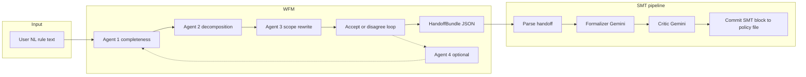

# Pipeline: Natural language → WFM → SMT-LIB policy

**ClinCon / ASP product line:** the active pivot is documented in **`docs/pipeline_wfm_to_asp.md`** with implementation plan **`dev_plans/dev_plan_implementation_clincon_asp_v1.md`**. This file remains the reference for the **SMT-LIB** path (e.g. branch `smt-pipeline`, tag `wfm-smt-baseline`).

This document is the canonical story of the **current** production-style path in this repository: how unstructured (or lightly structured) policy rules become **reviewed logical lines** under Word-for-Machine (WFM), then become **incremental SMT-LIB** policy commits under the `smt_pipeline`. It also states **scope** (what is intentionally in or out of each stage) and how this design **extends** to **larger policies built from many bundles** over time.

---

## 1. Why this pipeline exists

Organizations need to move from **English policy text** to **machine-checkable** artifacts without losing auditability. The pipeline splits that problem into two separable concerns:

1. **WFM** turns a single rule narrative into a **structured handoff**: discrete lines, each with an explicit Agent 3 verdict (pass, rewrite, reject scope, etc.), suitable for registry and downstream tooling.
2. **SMT pipeline** takes each accepted handoff and turns **in-scope** lines into **SMT-LIB** fragments, validates them with a **critic loop**, and **commits** them into a growing `policy_model`-style file.

Today we often run **WFM without registry resolution** (`skip_registry`) when the goal is only **handoff JSON → formalization**. The registry stage remains available for future “entity resolution” and warm-registry workflows.

---

## 2. End-to-end flow (conceptual)

**Artifacts today:**

| Stage | Primary output | Typical location |
|-------|----------------|------------------|
| WFM accept | `HandoffBundle` (`registry_persistence_v1`) | `bundles/wfm_artifacts/<bundle_id>.json` (+ `manifest.jsonl`) |
| SMT success | Policy fragment + bundle record | `bundles/smt_from_wfm/policies/<stem>.smt2`, `bundles/smt_from_wfm/<bundle_id>.json`, `*.log.jsonl` |

---

## 3. Stage A — Input to WFM

**Input:** Free-text policy (examples: FOLIO/P-FOLIO/stress examples, or ad hoc rules). Loaded from CLI (`--text` / `--file`), demo pools, or batch harnesses.

**WFM (many-sorted FOL):** Orchestration loads prompts from **`smt/wfm/`** (frozen copy of the `smt-pipeline` branch `WFM/` tree). Run WFM with **`python -m wfm_orchestration.cli --wfm-profile smt --skip-registry`** (plus `--text` / `--file`) when producing handoffs for **`smt_pipeline`**. The **ASP / ClinCon** profile uses **`asp/wfm/`** (`--wfm-profile asp`, default). A stub **`WFM/README.md`** at repo root points here for old links.

**Execution:** `wfm_orchestration` runs **Agents 1 → 2 → 3** via Gemini (`call_gemini` in `test_sets/scripts/run_wfm_folio_gemini.py`), then prompts for **acceptance** of the confirmation package. Users may **disagree** and trigger **Agent 4** plus Style-A merge, with up to **four** outer passes.

**Configuration:** Model and generation knobs come from environment (e.g. `GEMINI_MODEL`, `GEMINI_THINKING_LEVEL`, temperature, max output tokens). Some models omit **thinking config** when the API rejects it (`model_supports_thinking_config`).

**Handoff-only path (evaluation):** `skip_registry=True` stops after writing `HandoffBundle` JSON and **does not** run M4 / `run_bundle_through_registry`. This is the usual path for **SMT evaluation** to avoid duplicate Gemini spend.

---

## 4. Stage B — WFM scope and “context” (what the handoff *means*)

### 4.1 What WFM produces

The durable object is a **`HandoffBundle`** (see `registry_stage/wfm_acceptance_handoff.py`):

- **`user_original_input`:** The initial NL as given.
- **`lines[]`:** One entry per decomposed line, with:
  - **`line_index`** (0-based),
  - **`statement_nl`** (canonical line text for downstream use),
  - **`agent3_verdict`:** `PASS`, `REWRITE`, `OUT_OF_SCOPE`, or other allowed values per `AGENT3_VERDICTS`,
  - Optional **`scope_report`** / **`diff_report`**,
  - **`agent2_line_text`** (traceability).

**`provider_model`** and **`wfm_pipeline_timestamps`** record which model accepted the package and when.

### 4.2 Scope: what WFM does *not* guarantee

- **OUT_OF_SCOPE** lines are **intentionally not** treated as first-class logic for SMT in the current pipeline: they remain in the JSON for audit but **do not** receive formal rules (see `smt_pipeline.pipeline._is_in_scope`).
- **REWRITE** lines **are** still “in scope” for formalization unless verdict handling changes; they represent Agent 3’s cleaned wording, not a skip.
- **Temporal / state-history / open-class** narratives may be marked OUT_OF_SCOPE by Agent 3 (stress harness behavior): the **original** story may be **inconsistent or unprovable**, while the **remaining** PASS lines may still be **SAT** when formalized in isolation.
- WFM does **not** emit Z3: it emits **NL lines + verdicts** only.

### 4.3 Artifact layout (WFM)

- Default directory: `bundles/wfm_artifacts/`
- File: `<bundle_id>.json`
- `manifest.jsonl` appends one JSON line per successful write (paths, `example_id`, hint for `smt_pipeline --handoff`).

Batch helpers (`run_hard_batch.py`, curated JSON lists) exist to pace API calls and **skip** examples that already have a handoff file.

---

## 5. Stage C — SMT pipeline (handoff → policy)

**Entry:** `python -m smt_pipeline --handoff <path> --policy-model <path> --out-bundle-dir <dir>`

Implementation: `smt_pipeline.pipeline.run_smt_pipeline` (`control_flow_v3` design; see `dev_plans/control_flow_v3.md` for rationale).

### 5.1 Steps (summary)

1. **Load** handoff JSON; **parse** into `HandoffBundle` (`parse_handoff_bundle`).
2. **Partition lines:** `OUT_OF_SCOPE` → tracked as out-of-scope indices only; **in-scope** lines become candidates for rules.
3. **Context guard:** If `len(policy_text) + len(handoff_json)` (as UTF-8) exceeds **`context_char_limit`** (default 900k, env `SMT_PIPELINE_CONTEXT_CHAR_LIMIT`), the run fails with **CONTEXT_LIMIT_EXCEEDED** without calling Gemini.
4. **Formalizer loop (syntax):** For in-scope lines, Gemini proposes an SMT-LIB **block**; Z3 parse check; retries up to **`syntax_repair_cap`**.
5. **Critic loop (semantics):** Gemini JSON critic (`critic_v3.md`); repairs up to **`semantic_repair_cap`** when not approved.
6. **Commit:** On success, **prepend-aware** merge into the policy file (`_commit_bundle`), with bundle header comments.

**Outputs:**

- **Policy:** Monotonic append to `--policy-model` (often **one file per bundle** in batch demos, e.g. `bundles/smt_from_wfm/policies/<handoff_stem>.smt2`).
- **Bundle record:** `<bundle_out_dir>/<bundle_id>.json` with `pipeline_status`, `policy_model_path`, `wfm_payload`, failures, etc.
- **Structured log:** `<bundle_out_dir>/<bundle_id>.log.jsonl`.

**Batch:** `python -m smt_pipeline.run_wfm_handoff_batch` walks WFM handoffs with **delay**, **resume** (skip already-committed bundle records), and **per-bundle policy paths**.

**SAT / unsat core:** `python -m smt_pipeline.policy_check` or `python -m smt_pipeline.run_policy_batch_check` runs Z3 `check-sat` and optional **unsat core** over `; Rule:`-tagged asserts (`smt_pipeline/unsat_core.py`).

---

## 6. Context and limits (SMT side)

| Concept | Meaning |
|---------|---------|
| **Handoff JSON** | Serialized `HandoffBundle`; included in formalizer/critic **context** as structured policy text. |
| **Existing policy** | If `--policy-model` already exists and parses, new rules **concatenate** (subject to **rule_cap** and parse checks). |
| **`context_char_limit`** | Hard cap on **policy + handoff** payload size before any LLM call. |
| **`rule_cap`** | Upper bound on **committed** rules in the policy after considering existing rule count + in-scope lines. |
| **Repair caps** | Bound formalizer/critic retry attempts (env-overridable). |

This is the practical definition of **“context”** for the SMT stage: **policy file + current handoff**, not the whole conversation history from WFM.

---

## 7. Multi-bundle and “larger policy models” (direction)

**Today:** Each evaluation handoff often maps to **its own policy file**, so SAT checking and sharing are **per-bundle** and **independent**.

**Tomorrow (same codebase, extended usage):**

- **Accumulation:** Point **`--policy-model`** at a **single shared** `policy_model.smt2` (or partitioned files merged by convention) and run **multiple** handoffs in sequence. Each successful run **appends** a **normative block** tagged by `bundle_id` (headers in committed fragments).
- **Ordering:** Order of commitment **matters** for human readability and sometimes for overlapping symbols; automation should **append in a deterministic order** (e.g. bundle creation time, or tenant-defined priority).
- **Consistency:** Cross-bundle **name clashes** in SMT sorts/functions must be managed (prefixing, namespaces, or a future “registry” of symbols). Today, **isolation per file** avoids that; **unified** policy will need **naming discipline** or **merging** rules.
- **Verification:** `policy_check` / unsat cores apply to the **whole accumulated** theory if all asserts live in one tracked file—or **per bundle** if policies stay split.
- **WFM’s role:** Still **one narrative → one HandoffBundle**; scaling up is **many bundles → one policy store**, not one giant WFM session.

The **registry stage** (`run_bundle_through_registry`) remains the path for **entity resolution and line-level traces** against a living registry when product requirements need it; the **SMT pipeline** can consume the **same** handoff JSON either way.

---

## 8. CLI quick reference

| Goal | Command |
|------|---------|
| WFM e2e (interactive) | `python -m wfm_orchestration.cli` / `python -m wfm_orchestration.demo_launcher` |
| WFM → handoff only (batch) | `python -m wfm_orchestration.run_hard_batch --delay-sec 30` |
| SMT one handoff | `python -m smt_pipeline --handoff ... --policy-model ... --out-bundle-dir ...` |
| SMT batch from WFM dir | `python -m smt_pipeline.run_wfm_handoff_batch --delay-sec 30` |
| Chunked NL → one growing `policy_model.smt2` | `python -m wfm_orchestration.nl_chunk_smt_policy_pipeline --nl-file path/to/rules.md` (state: `exports/nl_chunk_smt_runs/<stem>/`; WFM uses `smt/wfm/`) |
| FOLIO JSONL → WFM (smt) → SMT (resume) | `python -m smt_pipeline.run_folio_wfm_smt_batch --limit 5 --split validation` (state: `exports/folio_smt_batch/`) |
| SAT / unsat core (one file) | `python -m smt_pipeline.policy_check <policy.smt2>` |
| SAT batch | `python -m smt_pipeline.run_policy_batch_check --out-json ...` |

---

## 9. Related code paths

- WFM orchestration: `wfm_orchestration/orchestrator.py`, `wfm_orchestration/handoff_artifacts.py`
- Handoff schema / builders: `registry_stage/wfm_acceptance_handoff.py`, `registry_stage/models.py`
- SMT pipeline: `smt_pipeline/pipeline.py`, `smt_pipeline/llm_steps.py`, `smt_pipeline/config.py`
- Unsat core: `smt_pipeline/unsat_core.py`

This document describes behavior as implemented in the **`smt-pipeline`** line of development; when in doubt, treat the referenced modules as authoritative.
